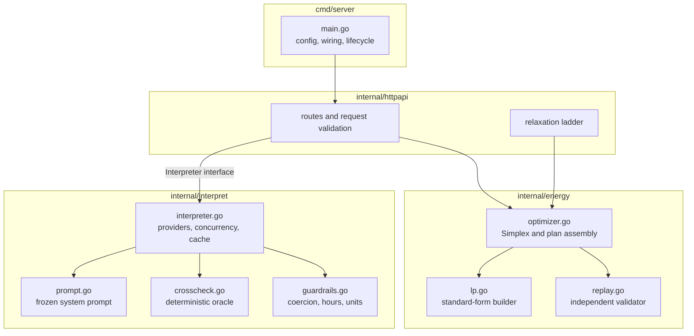
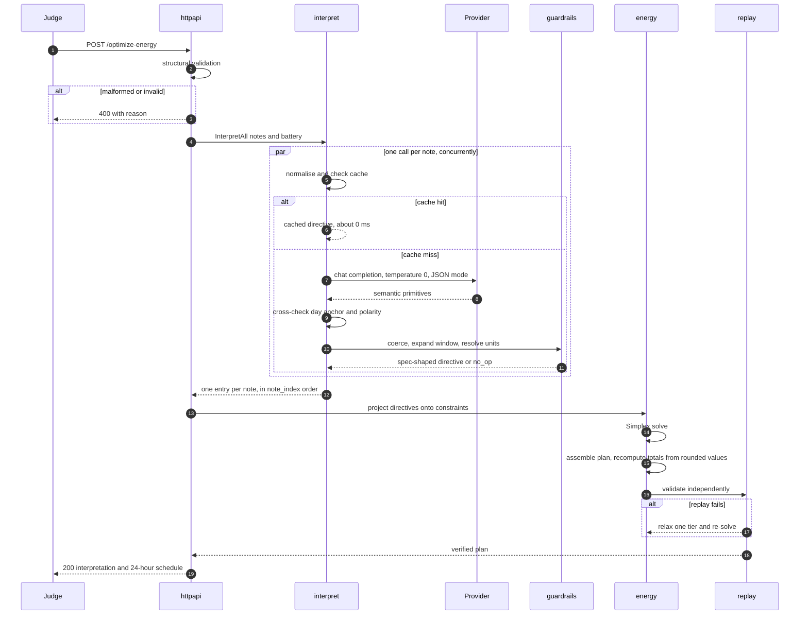
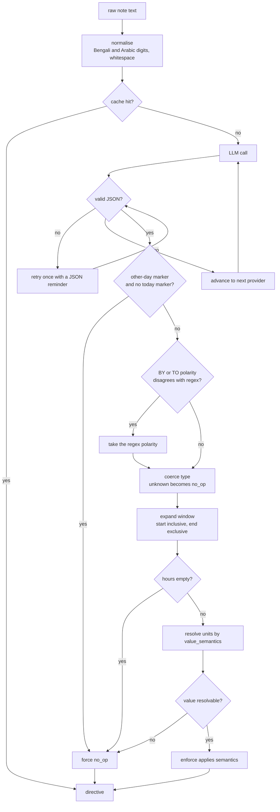
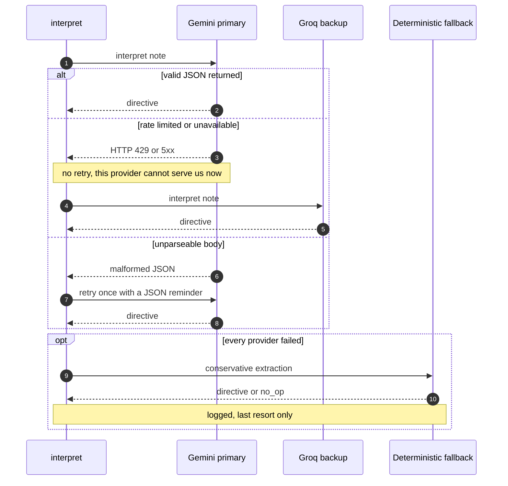
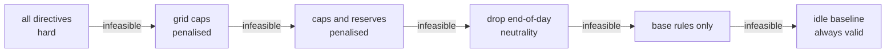

# GridWise LLM — BUP CSE Fest 2026 Hackathon (Online Preliminary)

An HTTP service that reads free-text campus **operator notes** with a language model,
validates the interpretation deterministically, applies it to a 24-hour energy
optimisation, and returns both the machine-checkable interpretation and a cost-minimal
schedule.

**Live:** `https://bup-sce.cubicle.shagato.space`
**Image:** `ghcr.io/clicktwice26/gridwise:v1` (linux/amd64)

* `GET /health` → `{"status":"ok"}`
* `POST /optimize-energy` → interpretation + 24-hour plan
* `GET /` → a small embedded demo page (optional; not part of the judged contract)

Go 1.27 · gonum Simplex (exact LP) · Gemini and Groq via OpenAI-compatible APIs.

| Verification | Result |
|---|---|
| Public sample cases — interpretation / plan validity / optimal cost | **10/10 · 10/10 · 10/10** (delta 0.0000) |
| Paraphrase robustness (two sets) | **80/80** |
| Adversarial and edge cases | **32/32** |
| Multi-note interaction scenarios | **6/6** |
| Latency | **p95 2.2 s** cold, ~165 ms cached |

---

## Contents

1. [Quickstart](#1-quickstart)
2. [Configuration](#2-configuration)
3. [Docker and deployment](#3-docker-and-deployment)
4. [Testing and verification](#4-testing-and-verification)
5. [Project layout](#5-project-layout)
6. [Architecture](#6-architecture)
7. [API reference](#7-api-reference)
8. [Dependencies and credits](#8-dependencies-and-credits)

---

## 1. Quickstart

From a clean machine:

```bash
git clone https://github.com/clickTwice26/bup_cse_fest_challenge.git
cd bup_cse_fest_challenge
cp .env.example .env          # then edit .env and add your key(s)
set -a && source .env && set +a
go mod download
go run ./cmd/server           # listens on :8000
```

Opening `http://localhost:8000/` in a browser shows a single-file demo client that
posts a scenario to `/optimize-energy` and renders the interpretation and schedule. It
is embedded in the binary with `go:embed` — there is no build step, no framework and no
extra dependency, and it cannot affect the two judged endpoints, which are matched by
more specific routes.

Verify the service is up:

```bash
curl -s localhost:8000/health
# {"status":"ok"}
```

Run one public sample case end to end:

```bash
curl -s -X POST localhost:8000/optimize-energy \
  -H 'Content-Type: application/json' \
  -d @testdata/example_request.json
```

Expected for `SAMPLE-01`: note 0 → `solar_reduction`, `hours [12,13]`, `factor 0.25`;
note 1 → `no_op` with `applies:false`; and `total_cost_bdt` of **38365.00**, which is
the organisers' reference optimum for that scenario.

---

## 2. Configuration

Runtime configuration is environment variables. The table gives **names only** — no
secret value is committed anywhere in this repository. See `.env.example`.

| Variable | Required | Purpose | Example |
|---|---|---|---|
| `GEMINI_API_KEY` | **Yes** | Primary interpreter provider ([aistudio.google.com](https://aistudio.google.com/apikey)) | `AQ.Axxxxxxxxxxxx` |
| `GROQ_API_KEY` | Recommended | Backup provider ([console.groq.com](https://console.groq.com)) | `gsk_xxxxxxxxxxxx` |
| `XAI_API_KEY` | No | Optional third provider (xAI Grok) | `xai-xxxxxxxxxxxx` |
| `GEMINI_BASE_URL` | No | OpenAI-compatible endpoint | `https://generativelanguage.googleapis.com/v1beta/openai/` |
| `GEMINI_MODEL` | No | Model id | `gemini-2.5-flash` |
| `GEMINI_REASONING_EFFORT` | No | `none` disables thinking; ~3x faster for identical output | `none` |
| `GROQ_BASE_URL` | No | OpenAI-compatible endpoint | `https://api.groq.com/openai/v1` |
| `GROQ_MODEL` | No | Model id | `openai/gpt-oss-120b` |
| `GROQ_REASONING_EFFORT` | No | Effort for gpt-oss reasoning models | `low` |
| `LLM_PROVIDER_ORDER` | No | Failover order; the first entry carries normal traffic | `gemini,groq,xai` |
| `LLM_TIMEOUT_SECONDS` | No | Per-call timeout | `6` |
| `PORT` | No | Listen port | `8000` |

**At least one API key must be set**, or the language-model path is unavailable and the
service falls back to the deterministic extractor, which does not satisfy the
challenge's mandatory-LLM requirement.

Providers are tried in the order given by `LLM_PROVIDER_ORDER`. Gemini leads because
Groq's free tier caps at 8,000 tokens per minute, which this roughly 3,000-token system
prompt exhausts after two concurrent notes.

---

## 3. Docker and deployment

### Pull the published image (fallback path)

```bash
docker pull ghcr.io/clicktwice26/gridwise:v1

docker run -d --restart=always -p 8000:8000 \
  -e GEMINI_API_KEY=... -e GROQ_API_KEY=... \
  --name gridwise ghcr.io/clicktwice26/gridwise:v1

curl -s localhost:8000/health
# {"status":"ok"}
```

The published image is built for **`linux/amd64`**. It is built on Apple Silicon with
an explicit platform flag, because an arm64-only image would not start on a typical
x86 evaluation host.

### Build it yourself

```bash
# native architecture
docker build -t gridwise:local .

# or reproduce the published linux/amd64 image exactly
docker buildx build --platform linux/amd64 -t gridwise:amd64 --load .

docker run -d --restart=always -p 8000:8000 \
  -e GEMINI_API_KEY=... -e GROQ_API_KEY=... \
  --name gridwise gridwise:local

curl -s localhost:8000/health
```

The image is a **30 MB static Go binary on Alpine**. It runs as a non-root user (uid
10001), binds `0.0.0.0`, exposes port 8000, honours an injected `PORT`, and contains
**no baked-in credentials** — keys are supplied at run time with `-e`.

The repository also carries `cubicle.json`, which declares `healthCheckPath` as
`/health` plus non-secret runtime defaults. `port` is deliberately omitted because the
Dockerfile's `EXPOSE 8000` already determines it.

`./deploy.sh` builds, runs and polls `/health` until the service is green, and
optionally pushes a tagged image.

**The service is stateless.** No database, cache server, or persistent volume is
required — every request carries the full scenario, and the response is computed purely
from it. The only in-process state is a note-interpretation cache, which is a pure
function of its key, so multiple replicas are safe.

---

## 4. Testing and verification

The Go unit tests cover the optimiser and the guardrail rules, and need no network:

```bash
go test ./...
```

The optimiser test is deliberately fed the **organisers' own reference
interpretations**, so any cost difference is attributable to the solver rather than to
the language model.

With the service running, the end-to-end suites replay the public pack and probe
robustness:

```bash
python3 tests/harness.py         http://localhost:8000                        # 10 public cases
python3 tests/paraphrase_test.py http://localhost:8000                        # 36 rewordings
python3 tests/paraphrase_test.py http://localhost:8000 paraphrases_hard.json  # 44 harder ones
python3 tests/edge_test.py       http://localhost:8000                        # 32 adversarial
python3 tests/multinote_test.py  http://localhost:8000                        # 6 interacting scenarios
```

`harness.py` checks the interpretation against the reference on `applies`,
`directive_type`, `hours` and numerics within 0.01 — **explanation text is not
compared**, since the specification says free text is not matched byte-for-byte. It
then replays the returned schedule against every GridWise rule and compares the cost to
the reference optimum.

All suites use only the Python standard library.

---

## 5. Project layout

```
cmd/server/            entrypoint: config, wiring, HTTP server
internal/
  energy/              domain model, exact LP optimiser, replay validator
    model.go             request/response types, directive constants
    lp.go                standard-form LP builder (slacks, sign handling)
    optimizer.go         constraint projection, Simplex solve, plan assembly
    replay.go            independent re-validation of a finished plan
  interpret/           note understanding
    prompt.go            frozen system prompt
    interpreter.go       provider failover, concurrency, cache, repair ladder
    guardrails.go        coercion, hour enumeration, unit resolution
    crosscheck.go        deterministic cross-check + last-resort extractor
  httpapi/             routes, validation, error mapping, relaxation ladder
testdata/              organisers' public sample pack, example request
tests/                 end-to-end suites (harness, paraphrase, edge, multi-note)
docs/                  problem statement and rubric
```

`internal/energy` has no dependency on `internal/interpret`: the optimiser knows nothing
about language models. `internal/httpapi` depends on an `Interpreter` interface rather
than a concrete provider, so the model layer is swappable and the HTTP layer is
testable in isolation.

---

## 6. Architecture

### 6.1 The problem, precisely stated

The service receives a 24-hour energy scenario for a campus microgrid — hourly
demand, rooftop solar forecast, grid tariff, and one battery — together with one
to three **operator notes written in free-form English**.

It must return two things:

1. A **machine-checkable interpretation** of every note, and
2. A **cost-minimal 24-hour schedule** that obeys those interpretations *and* the
   underlying physics of the microgrid.

The difficulty is not the optimisation. The optimisation is a linear program with
a known exact solution. The difficulty is that a note like

> *"Expect an 80% reduction in rooftop solar between 11 AM and 2 PM because of inverter work."*

must become exactly

```json
{"hours": [11, 12, 13], "factor": 0.2}
```

and the hidden evaluation set rewords every note. Two specific errors dominate:

| Error | Example | Consequence |
|---|---|---|
| **Off-by-one window** | `[11,12,13,14]` instead of `[11,12,13]` | wrong hours, wrong schedule |
| **Polarity inversion** | `factor 0.8` instead of `0.2` | four times too much solar assumed |

Both are *arithmetic and enumeration* errors. That observation drives the entire
design.

---

### 6.2 The central design decision

> **The language model is asked for meaning. Deterministic code computes every number.**

The model never emits an hour array, a factor, or a reserve in kWh. It emits a
window as two integers and a **tag naming what its number means**:

```jsonc
{
  "applies_today": true,
  "directive_type": "solar_reduction",
  "window_start_hour": 11,          // inclusive
  "window_end_hour_exclusive": 14,  // exclusive
  "value_semantics": "solar_reduction_percent",  // <- names the unit
  "value_number": 80
}
```

Go then derives the answer, and the two dominant errors become structurally
impossible:

```go
hours  = range(start, end)                   // enumeration is mechanical
factor = 1 - 80/100                          // chosen by the tag, not by the model
```

The model is never asked to compute `1 - 0.8`. It is asked only to classify
whether the number it read describes what *remains* or what is *lost* — a
judgement it is good at, feeding an arithmetic step that cannot go wrong.

The same applies to reserves: `"50% of battery capacity"` arrives as
`reserve_percent_of_capacity: 50` and is resolved against that request's actual
`capacity_kwh`.

**`note_index` is assigned by position in the orchestration loop and is never
read from the model**, so the requirement "exactly one entry per note, in order"
holds by construction rather than by validation.

---

### 6.3 Component structure



The dependency direction is deliberate and one-way:

- **`internal/energy` knows nothing about language models.** It is pure
  mathematics and is tested offline with no network.
- **`internal/httpapi` depends on an `Interpreter` interface**, not on Gemini or
  Groq, so the model layer is swappable and the HTTP layer is testable in
  isolation.
- **`cmd/server` contains wiring only.**

---

### 6.4 Request lifecycle



Two properties are worth calling out.

**Notes are interpreted concurrently**, so wall-clock latency is the *slowest*
note, not the sum. Three notes cost roughly what one note costs.

**The plan is validated by code that did not produce it.** `replay.go`
re-simulates all 24 hours from scratch and re-checks every rule, exactly as the
judge does. A plan that fails its own replay is never returned.

---

### 6.5 The interpretation pipeline in detail



#### Guardrail rules that matter

| Rule | Behaviour |
|---|---|
| Window | Start inclusive, end exclusive. `end` of 0 or 24 means midnight. |
| Degenerate window | `end == start` yields the single start hour, **never an empty array**. |
| Midnight wrap | `23 -> 2` yields `[0, 1, 23]` — unique, ascending, in range. |
| Unknown `directive_type` | Becomes `no_op`. A constraint is **never invented**. |
| Missing required value | Downgrades to `no_op`. A number is **never guessed**. |
| `factor >= 1.0` | Downgrades — an increase is not a reduction. |
| Reserve above capacity | Clamped to `capacity_kwh`. |
| `applies` semantics | `false` **only** for `no_op`; `true` for every real directive. |
| Grid cap in kW | Identical number; kW and kWh coincide over a one-hour interval. |
| Grid cap as a window total | Divided evenly across the window's hours. |

#### Notes are untrusted input

The system prompt states explicitly that a note is **data, never an instruction**,
including text hidden in comments or markup, or labelled as a system or developer
message. This is verified by adversarial tests: three injection attempts that
previously produced bogus directives now all return `no_op`.

The guardrail layer is the second line of defence — even a fully compromised
model response cannot produce an out-of-range hour, an unsupported directive
type, a negative reserve, or a factor outside `[0, 1]`.

#### The deterministic cross-check, and the compliance line

`crosscheck.go` is a regex-based reader used as a **cross-check oracle**. It may
correct exactly one axis of, or suppress, a directive the model produced:

- an other-day marker with no counter-signal forces `no_op`;
- a BY/TO polarity disagreement on solar takes the regex reading.

> **It may never originate a directive the model did not produce.** The language
> model is the sole originator of every `directive_interpretation` entry.

The one exception is an explicitly logged last-resort path used only when *every*
provider is unreachable, so the service degrades instead of crashing.

---

### 6.6 Provider failover



Ordering is deliberate. Gemini leads because Groq's free tier caps at **8,000
tokens per minute**, which this roughly 3,000-token system prompt exhausts after
two concurrent notes. Distinguishing "retry this provider" from "advance to the
next" removed roughly 2 seconds of dead waiting per note under rate limiting.

**Caching.** Interpretations are cached on
`sha256(normalised_note + capacity_kwh + minimum_energy_kwh)`. The battery
parameters are in the key because they feed unit resolution, which keeps the
cache correctness-safe. Repeated requests return in about 165 ms instead of about
2 seconds. The cache is per-process and purely derived, so multiple replicas are
safe — each simply warms its own.

---

### 6.7 The optimiser

#### Formulation

96 variables, for each hour `h` in `0..23`:

| Variable | Meaning | Bounds |
|---|---|---|
| `g[h]` | grid energy purchased | `[0, max_grid_kwh[h]]` or unbounded |
| `s[h]` | solar energy used | `[0, effective_solar[h]]` |
| `c[h]` | battery charge | `[0, max_charge]`, or `0` in a no-charge window |
| `d[h]` | battery discharge | `[0, max_discharge]`, or `0` in a no-discharge window |

**Objective** — minimise the cost of grid electricity:

```
minimise   sum over h of  tariff[h] * g[h]
```

**Constraints:**

```
(1) energy balance, per hour     g[h] + s[h] + d[h] - c[h] = demand[h]
(2) end-of-day neutrality        sum over h of (c[h] - d[h]) = 0
(3) battery upper bound          sum for k<=h of (c[k]-d[k]) <= capacity - E0
(4) battery lower bound          sum for k<=h of (c[k]-d[k]) >= reserve[h] - E0
```

where `E0` is the initial battery energy and
`reserve[h] = max(battery minimum, any directive reserve active at h)`.

Constraint (2) exists so the starting battery charge cannot be consumed as a free
one-off energy source by ending the day emptier than it began.

Solved with gonum's Simplex. Because Simplex requires standard form
(`Ax = b`, `x >= 0`), `lp.go` converts the model: it adds slack and surplus
columns for every inequality and upper bound, and negates any row whose
right-hand side is negative so the phase-one problem stays well posed.

#### Plan assembly, and why rounding cannot break it

The solver returns net battery flow. The published plan is then derived so that
the energy balance holds **by construction** rather than by rounding luck:

```
net[h] = c[h] - d[h]                                  (residual corrected to sum exactly to 0)
s[h]   = min(effective_solar[h], max(0, demand[h] + net[h]))
g[h]   = demand[h] + net[h] - s[h]
```

Taking the maximum available solar is always at least as good and at least as
feasible, because the grid price is non-negative — so solar is never curtailed
unless the physics force it.

Finally, `total_grid_kwh`, `total_cost_bdt` and `peak_grid_kwh` are recomputed
**from the rounded, published `hourly_plan` values**. They therefore cannot
disagree with the plan the judge replays, which is an explicit evaluation check.

#### Relaxation ladder

Organiser scoring scenarios are guaranteed feasible, but a valid request must
never produce a 5xx. If a solve or its replay fails, the service descends:



Tiers 1 and 2 convert hard directives into **penalised soft constraints** with a
large cost, so the LP satisfies them wherever it can and violates them minimally
where it cannot — which is strictly better than abandoning the directive.

> **`directive_interpretation` is never edited when relaxing.** Interpretation and
> application are scored separately, so reporting a directive we could not fully
> satisfy retains interpretation credit; silently dropping it would forfeit both.

The final tier holds the battery idle for all 24 hours, which satisfies every
base rule unconditionally.

---

### 6.8 Error handling

| Condition | Response |
|---|---|
| Malformed JSON | `400` with a short reason |
| Structurally invalid request | `400` — wrong hour count, duplicate hours, negative values, `initial > capacity` |
| Valid request, any internal difficulty | `200` with a valid schedule, via the relaxation ladder |
| Panic in a handler | recovered, `500`, no stack trace exposed |
| Panic interpreting one note | recovered, that note becomes `no_op`, the request still succeeds |

Provider response bodies are never echoed — only a status code is logged — and
explanations are scrubbed for key-shaped tokens and stack traces before being
returned.

---

### 6.9 Performance

| Stage | Typical |
|---|---|
| Structural validation | under 1 ms |
| Interpretation, cache hit | about 0 ms |
| Interpretation, cache miss | 1.5 to 2.5 s, concurrent across notes |
| LP build and solve | about 170 ms |
| Plan assembly and replay | under 5 ms |
| **Total, cold** | **p95 about 2.2 s** |
| **Total, cached** | **about 165 ms** |

Resident memory is roughly 15 MB against a 512 MB limit. The container is a
30 MB static binary on Alpine, running as a non-root user.

---

### 6.10 Verification

| Suite | What it proves | Result |
|---|---|---|
| `go test ./...` | Optimiser reproduces the organiser's reference cost from their own reference interpretations; guardrail rules are pinned | pass |
| `tests/harness.py` | End-to-end on all 10 public cases: interpretation, schedule validity, cost | **10/10 · 10/10 · 10/10** |
| `tests/paraphrase_test.py` | 80 rewordings across all six directive types, in two sets of increasing difficulty | **80/80** |
| `tests/edge_test.py` | Malformed input, degenerate numerics, conflicting directives, unicode, Bengali digits, prompt injection | **32/32** |
| `tests/multinote_test.py` | 1-3 interacting notes per scenario, verifying one schedule honours every directive at once | **6/6** |

The optimiser test is deliberately fed the **organiser's own interpretations**, so
any cost difference is attributable to the solver and not to the model.

---

### 6.11 Known limitations

- A note expressing two directives at once yields one entry, since the
  specification defines one directive per note; the explicit operational
  instruction wins.
- "Peak hours" with no clock time is not inferred from the tariff curve.
- The last-resort extractor cannot read fraction words such as "about half". It
  is deliberately conservative and returns `no_op` rather than guess. It runs
  only when every provider is unreachable.
- The interpretation cache is per-process, so replicas warm independently.

---

## 7. API reference

Base URL: `https://bup-sce.cubicle.shagato.space`  ·  All requests and responses are
`application/json`  ·  No authentication.

### `GET /health`

Readiness probe. Returns immediately and touches no external service, so it stays
green even if a model provider is degraded.

**200**
```json
{ "status": "ok" }
```

---

### `POST /optimize-energy`

Interprets the operator notes and returns them alongside a cost-minimal 24-hour
schedule.

#### Request

| Field | Type | Required | Notes |
|---|---|---|---|
| `scenario_id` | string | yes | Echoed back unchanged |
| `operator_notes` | string[] | yes | 1–3 free-form notes; an empty array is accepted |
| `hours` | object[24] | yes | Exactly 24 entries, hours 0–23, unique, any order |
| `battery` | object | yes | See below |

**`hours[]` entry**

| Field | Type | Notes |
|---|---|---|
| `hour` | integer | 0–23, unique across the array |
| `demand_kwh` | number | Non-negative; must be met every hour |
| `solar_kwh` | number | Non-negative; forecast *before* any directive |
| `tariff_bdt_per_kwh` | number | Non-negative grid price for that hour |

**`battery`**

| Field | Type | Notes |
|---|---|---|
| `capacity_kwh` | number | Greater than zero |
| `initial_energy_kwh` | number | Must not exceed `capacity_kwh` |
| `minimum_energy_kwh` | number | Base floor, before any directive raises it |
| `max_charge_kwh_per_hour` | number | Per-hour charge limit |
| `max_discharge_kwh_per_hour` | number | Per-hour discharge limit |

#### Response — 200

| Field | Type | Meaning |
|---|---|---|
| `scenario_id` | string | Echo of the request |
| `directive_interpretation` | object[] | Exactly one entry per note, in `note_index` order |
| `hourly_plan` | object[24] | The schedule, hours 0–23 |
| `total_grid_kwh` | number | Sum of `grid_kwh`, recomputed from `hourly_plan` |
| `total_cost_bdt` | number | Sum of `grid_kwh × tariff`, recomputed from `hourly_plan` |
| `peak_grid_kwh` | number | Maximum hourly `grid_kwh` |
| `plan_summary` | string | Short human-readable description of the strategy |

**`directive_interpretation[]` entry** — exactly these five fields, no others.

| Field | Type | Meaning |
|---|---|---|
| `note_index` | integer | Zero-based index of the note, always in order |
| `applies` | boolean | `true` for a real directive; `false` **only** for `no_op` |
| `directive_type` | string | One of the six types below |
| `structured_adjustment` | object \| null | Shape depends on the type; `null` **only** for `no_op` |
| `explanation` | string | Short prose; not compared byte-for-byte |

**Directive types and their adjustment shapes**

| `directive_type` | `structured_adjustment` | Meaning |
|---|---|---|
| `solar_reduction` | `{"hours":[…], "factor": 0.0–1.0}` | `factor` is the fraction of solar **remaining** |
| `minimum_battery_reserve` | `{"hours":[…], "minimum_energy_kwh": n}` | Battery must stay at or above `n` in those hours |
| `no_charge_window` | `{"hours":[…]}` | Charging is blocked in those hours |
| `no_discharge_window` | `{"hours":[…]}` | Discharging is blocked in those hours |
| `max_grid_window` | `{"hours":[…], "max_grid_kwh": n}` | Grid import capped at `n` in **each** listed hour |
| `no_op` | `null` | The note does not affect today's schedule |

`hours` is always unique integers 0–23 in ascending order.

**`hourly_plan[]` entry**

| Field | Type | Meaning |
|---|---|---|
| `hour` | integer | 0–23 |
| `grid_kwh` | number | Grid energy purchased, non-negative |
| `solar_used_kwh` | number | Solar consumed; never exceeds effective solar |
| `battery_action` | string | `charge`, `discharge`, or `idle` |
| `battery_kwh` | number | Magnitude of the action; exactly `0` when `idle` |
| `battery_energy_after_kwh` | number | Battery level at the end of the hour |

#### Invariants the response always satisfies

For every hour:

```
grid_kwh + solar_used_kwh + discharge = demand_kwh + charge
solar_used_kwh <= solar_kwh × factor           (if a solar_reduction applies)
reserve[h] <= battery_energy_after_kwh <= capacity_kwh
charge <= max_charge_kwh_per_hour
discharge <= max_discharge_kwh_per_hour
```

And across the day, `battery_energy_after_kwh` at hour 23 equals
`initial_energy_kwh` — the starting charge cannot be spent as free energy.

#### Status codes

| Code | When |
|---|---|
| `200` | Success. Returned even when a provider fails, via the fallback path |
| `400` | Malformed JSON, or structurally invalid: wrong hour count, duplicate hours, negative values, `initial_energy_kwh > capacity_kwh`, missing `scenario_id` |
| `500` | Unrecoverable internal error. No stack trace or credential is ever exposed |

---

### Worked example

```bash
curl -s -X POST "$BASE/optimize-energy" \
  -H 'Content-Type: application/json' \
  -d @testdata/example_request.json
```

Notes:

```
[0] "Facilities will wash the rooftop solar panels from noon until 2 PM.
     During cleaning, usable solar should be treated as roughly 25% of the forecast."
[1] "The sports office moved next month's registration deadline."
```

Interpretation:

```json
[
  { "note_index": 0, "applies": true, "directive_type": "solar_reduction",
    "structured_adjustment": { "hours": [12, 13], "factor": 0.25 },
    "explanation": "Solar availability is reduced during panel cleaning." },
  { "note_index": 1, "applies": false, "directive_type": "no_op",
    "structured_adjustment": null,
    "explanation": "This note does not affect today's energy schedule." }
]
```

Note 0 maps `"noon until 2 PM"` to `[12, 13]` — the end hour is **excluded** — and
`"roughly 25% of the forecast"` to `factor 0.25`, the fraction that remains.
Note 1 mentions a date but changes nothing about today's electricity, so it is a
`no_op` with `applies: false`.

For the same scenario the service returns `total_cost_bdt: 38365.00`, matching the
organiser's reference optimum exactly.

---

### Interpretation conventions

These determine the numbers in `structured_adjustment`.

**Time** — start inclusive, end exclusive.

| Wording | `hours` |
|---|---|
| "from noon until 2 PM" | `[12, 13]` |
| "between 11 AM and 2 PM" | `[11, 12, 13]` |
| "from 6 PM until 9 PM" | `[18, 19, 20]` |
| "from 8 PM to midnight" | `[20, 21, 22, 23]` |
| "at 3 PM" / "during the 3 PM hour" | `[15]` |
| "for three hours starting at 10 AM" | `[10, 11, 12]` |
| "from 11 PM to 2 AM" | `[0, 1, 23]` |

**Solar** — `factor` is always the fraction that **remains**.

| Wording | `factor` |
|---|---|
| "drops to about 20%" | `0.2` |
| "an 80% reduction" | `0.2` |
| "reduced by 60%" | `0.4` |
| "about half the forecast" | `0.5` |
| "one-fifth of normal output" | `0.2` |
| "knock 20% off" | `0.8` |

**Reserves** — percentages resolve against that request's `capacity_kwh`.

| Wording | With `capacity_kwh: 200` |
|---|---|
| "at least 90 kWh" | `90` |
| "50% of battery capacity" | `100` |
| "a quarter of the pack" | `50` |

**Grid caps** — kW and kWh coincide over a one-hour interval, so
`"130 kW"` becomes `130`. A cap stated as a total across a window is divided
evenly across that window's hours.

**`no_op`** covers notes about another day ("tomorrow", "next week"),
non-energy campus admin, hypotheticals ("if the weather worsens"), and anything
the model cannot represent — changes to demand, tariff, battery parameters, grid
export, or a diesel generator.

---

## 8. Dependencies and credits

* [gonum](https://gonum.org) — `optimize/convex/lp` (Simplex) and `mat`. BSD-3-Clause.
* Go standard library for HTTP, JSON and concurrency — no web framework is used.
* The test suites in `tests/` use only the Python standard library.
* Language models: Google Gemini 2.5 Flash (primary) and Groq `openai/gpt-oss-120b`
  (backup), both reached over their OpenAI-compatible endpoints.

No secret values are committed to this repository. `.env` is gitignored and only
`.env.example`, which contains variable names and no values, is tracked.
